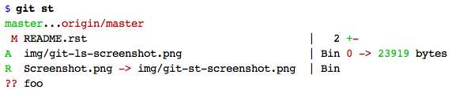

🗜 gitz - git commands for rapid development 🗜
------------------------------------------------------

This is a collection of seventeen git utilities, the majority of which
are aimed at people doing rapid development using Git.

Gitz is for two types of users - quality-obsessed individuals who relentlessly
manicure their pull requests until every byte is in the right place; and
ultra-rapid developers who want to generate large features quickly while taking
advantage of continuous integration.

Most of them only exist here, one comes from other git repos, one came
from a chat on Reddit and I don't know where one of them came from

Four of them are written in Bash, the rest use Python 3.

How to install
==============

Using `pip <https://pypi.org/project/pip/>`_:

.. code-block:: bash

    pip3 install gitz

Otherwise, download and uncompress
`this directory <https://github.com/rec/gitz/archive/master.tar.gz>`_,
then put that downloaded directory's path into the ``PATH``
environment variable.

Getting help
============

Below there's a summary of each command, and a link to a manual page.
Or from the terminal, use ``-h`` flag like this: ``git new -h``.

Safe commands
=============

Informational commands that don't change your repository

`git-gitz <doc/git-gitz.rst>`_
  Print information about the gitz environment

`git-infer <doc/git-infer.rst>`_
  Commit changes with an auto-generated message
  (from https://github.com/moondewio/git-infer)

`git-ls <doc/git-ls.rst>`_
  List each file with its most recent commit, in subtle color
  (from an unknown source)

.. image:: img/git-ls-screenshot.png

`git-new <doc/git-new.rst>`_
  Create and push new branches

`git-rotate <doc/git-rotate.rst>`_
  Rotate the current branch forward or backward in the list of branches

`git-st <doc/git-st.rst>`_
  Colorful, compact git status
  
  This version written by https://github.com/PlatyPew/, original
  version by https://www.reddit.com/user/ex1c)

`git-stripe <doc/git-stripe.rst>`_
  Push a sequence of commit IDs to a remote repository

Dangerous commands that delete, rename or overwrite branches
============================================================

`git-copy <doc/git-copy.rst>`_
  Copy a git branch locally and on all remotes

`git-delete <doc/git-delete.rst>`_
  Delete one or more branches locally and on all remotes

`git-rename <doc/git-rename.rst>`_
  Rename a git branch locally and on all remotes

By default, the branches ``develop`` and ``master`` and the remote ``upstream``
are protected - they are not allowed to be copied to, renamed, or deleted.

You can configure this in three ways:

- setting the ``--all/-a`` flag ignore protected branches entirely

- setting one of the the environment variables
  ``GITZ_PROTECTED_BRANCHES`` or ``GITZ_PROTECTED_REMOTES`` overrides these
  defaults

- setting a value for the keys ``PROTECTED_BRANCHES`` or ``PROTECTED_REMOTES``
  in the file .gitz.json in the top directory of your Git project

Dangerous commands that rewrite history
=======================================

Slice, dice, shuffle and split your commits.

These commands are not intended for use on a shared or production branch, but
can significantly speed up rapid development on private branches.

`git-amp <doc/git-amp.rst>`_
  AMend just the last commit message and force-Push, somewhat safely

`git-combine <doc/git-combine.rst>`_
  Combine multiple commits into one

`git-shuffle <doc/git-shuffle.rst>`_
  Reorder and delete commits in the existing branch

`git-snip <doc/git-snip.rst>`_
  Edit one or more commits out of history

`git-split <doc/git-split.rst>`_
  Split a range of commits into many single-file commits

`git-update <doc/git-update.rst>`_
  Update branches from the reference branch

Dangerous commands that are janky
=================================

``git-all`` is something I use all the time, but it only works in
simple cases, and I don't see a good path to making it do complicated
things in a sane way.

`git-all <doc/git-all.rst>`_
  Perform a command on each of multiple branches or directories
