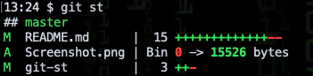

🗜 gitz - tiny useful git commands, some dangerous 🗜
-------------------------------------------------------------------

This is a collection of a dszen git utilities, each of which does one
useful thing well.

Most of them only exist here, one comes from other git repos, one came from a
chat on Reddit and I don't know where one of them came from

Nine of them are written in Python 3, the rest use Bash.

There's a summary of what each command does below - for more details use the
``-h`` flag like this:

.. code-block:: bash

    git all -h

How to install
================

If you have ``pip`` installed

.. code-block:: bash

    pip3 install gitz

Otherwise, download and uncompress
`this directory
<https://github.com/rec/gitz/archive/master.tar.gz>`_,
then put that directory's path into the ``PATH`` environment variable.

Getting help
==============

Each command has detailed help available by calling it with the -f flag, like
this: ``git all -h``.

A summary of the commands follows:

Safe commands
=============================================

``git-all``
  Perform a command on each of multiple branches or directories.

``git-fresh``
  Checkout and push a fresh branch

``git-ls``
  Like ``ls`` but shows git info, with good use of color
  (from an unknown source)

``git-infer``
  Commit changes with an auto-generated message
  (from https://github.com/moondewio/git-infer)

``git-rot``
  Rotate the current branch forward or backward in the list of branches

``git-st``
  Pretty, compact alternative to ``git-status``
  This version written by https://github.com/PlatyPew/, original
  version by https://www.reddit.com/user/ex1c)

``git-stripe``
   Push each commit in a series onto a separate remote branch

Dangerous commands that delete, rename or overwrite branches
=======================================================

``git-copy``
  Copy a branch locally and on every remote

``git-delete``
  Delete one or more branches locally and on every remote

``git-rename``
  Rename a branch locally and on every remote

By default, the branches ``develop`` and ``master`` and the remote ``upstream``
are not allowed to be copied, renamed, or deleted.

You can disable this by setting the ``--all/-a`` flag, or you can override the
protected branches or remotes by setting the environment variables
``PROTECTED_BRANCHES`` or ``PROTECTED_REMOTES``

Dangerous commands that rewrite history
==============================================

These commands are not intended for use on a shared or production branch, but
can significantly speed up rapid development on private branches.

``git-amp``
  AMend just the last commit message and force-Push, somewhat safely

``git-combine``
  Combine multiple commits into one

``git-snip``
  Edit one or more commits out of history

``git-shuffle``
  Rearrange recent commits in any order

``git-split``
  Split a commit into individual changes, one per file
